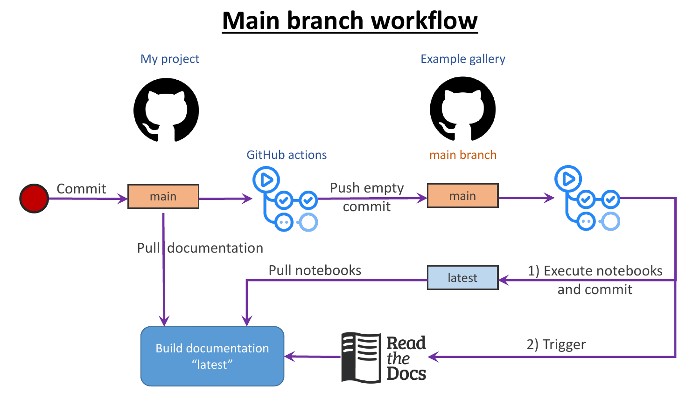
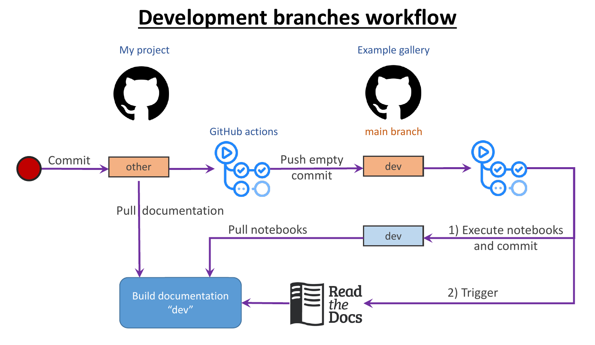
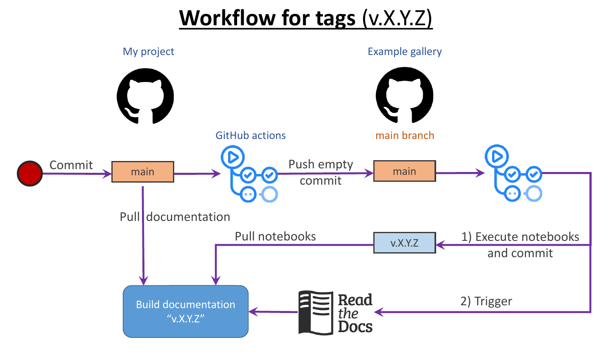

# Template for a python project with a separate example gallery

This repository contains a template of a python project with a documentation page that keeps the example gallery as a collection of jupyter notebooks in [a separate repository](https://github.com/aperezhortal/separated_nb_gallery_notebooks). This workflow is a reimplementation of the one used on the [wradlib project](https://github.com/wradlib/wradlib). Big thanks to wradlib for paving the way :raised_hands:. 

## Why separate the example gallery from the main repository

Some projects build their documentation directly from their sources using Read The Docs (RTD) services. These documentation pages are typically built after new commits are pushed or Pull Requests are merged to the main branch. Including extensive example galleries inside the projects increases the time needed to make the documentation. Hence, it is not uncommon to quickly reach the [time limits in Read the docs](https://docs.readthedocs.io/en/stable/builds.html). 

# How it works?

There are 3 possible workflow that can be triggered from the main repository:

- A workflow triggered by changes to the main branch.
- A workflow triggered by changes to any other branch that trigger the GH actions.
- A workflow triggered by tagged commits in the main branch.

